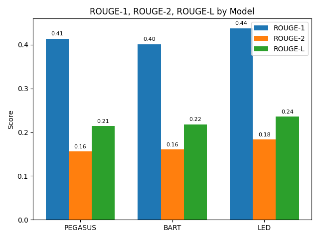

# Scalable Multi‑Document Summarization using Distributed Deep Learning

End‑to‑end pipeline for abstractive summaries of clusters of news articles, built for
CS 535 “Big Data” (Spring 2025).  
We fine‑tune **PEGASUS‑Large**, **BART‑Large‑CNN**, and **LED‑Base‑16384** on the
[Multi‑News](https://huggingface.co/datasets/alexfabbri/multi_news) corpus, using
PyTorch DDP for multi‑GPU/‑node training.


---

## Setup

```bash
conda create -n mds python=3.10
conda activate mds
# core libs
pip install torch torchvision --extra-index-url https://download.pytorch.org/whl/cu118
pip install transformers datasets evaluate sentencepiece ftfy accelerate
````

---

## Quick Smoke Test (CPU/GPU, 1 % data)

```bash
python scripts/train_on_subset.py \
  --configs configs/bart.yaml \
  --subset_ratio 0.01 \
  --epochs 1
```

Outputs appear in `outputs/bart_subset/`.

---

## Full Training on 4 GPUs

```bash
# edit configs/bart.yaml if you want a different batch size / lr
python scripts/run_distributed.py \
  --config configs/bart.yaml \
  --epochs 3
```

`run_distributed.py` detects `torch.cuda.device_count()` and launches
`torchrun` with `--nproc_per_node=$NGPU` automatically.

---

## Evaluation

```bash
python -m src.main eval \
  --config   configs/bart.yaml \
  --ckpt_dir outputs/bart/best_model \
  --split    test   \
  --num_samples 100
```

Per‑example records (`eval_records.json`) and aggregate CSV
(`eval_metrics.csv`) are saved beside the checkpoint.

---

## Key Features

* **Pre‑processing:** HTML strip, Unicode fix, contraction expansion, exact + fuzzy dedup.
* **Distributed Trainer:** PyTorch DDP, FP16, gradient checkpointing.
* **Evaluation Suite:** ROUGE‑1/2/L, BERTScore, extractiveness, density (+ bootstrap CI).
* **Modularity:** one CLI (`src/main.py`) driven by YAML; swap models or hyper‑params without code edits.

---

## Results

Here's a comparison of ROUGE scores for the fine-tuned models on the Multi-News test set (200 random samples):



| Metric                  | Pegasus        | LED            | BART           |
|-------------------------|----------------|----------------|----------------|
| ROUGE‑1                 | 0.414          | **0.438** | 0.402          |
| &nbsp;&nbsp;± Std. dev. | 0.009          | 0.010          | 0.009          |
| &nbsp;&nbsp;95% CI      | [0.394, 0.434] | [0.419, 0.454] | [0.385, 0.420] |
| ROUGE‑2                 | 0.156          | **0.183** | 0.161          |
| ROUGE‑L                 | 0.214          | **0.236** | 0.218          |
| BERTScore F<sub>1</sub> | 0.865          | 0.865          | 0.867          |
| Extractiveness          | 0.916          | 0.917          | 0.923          |
| Density (Compression)   | 0.122          | 0.152          | 0.115          |

---